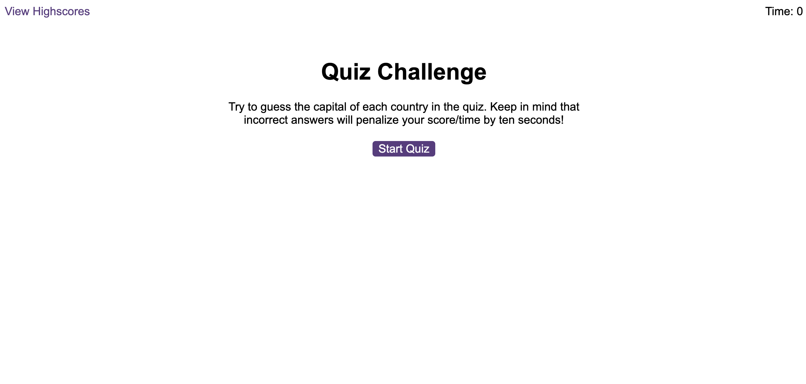

# Quiz-Code

## Description

The quiz code is a fun and engaging way to test your knowledge of countries and their capitals. It presents a series of multiple-choice questions, and for each correct answer, you earn 10 points and receive an auditory signal. However, if you answer incorrectly, 10 seconds are deducted from your timer. Once you complete the quiz, your score will be saved so that you can try to beat it later.

Link to the deployed project:
https://unicorn453.github.io/Quiz-Code/

When opened the page should look like this:

## Installation

N/A

## Usage

This project is a quiz code challenge that tests your knowledge of countries and their capitals. Each question presents a multiple-choice challenge. If you answer incorrectly, 10 seconds will be deducted from your timer. You will receive 10 points for each correct answer, and a sound will signify that. The timer for completing the challenge is located in the top right corner and is set for 75 seconds. If the time runs out, the challenge ends and the user is redirected to the high scores page. Once the game is complete, your score will be saved so you can return and try to beat it later. Write down your initials in the input field to save the score even if the page is refreshed. If the clear score button on the high score page is pressed, all the saved scores will be deleted.

## Credits

The development of the code process involved leveraging ChatGPT.
Other resources:
I used a previously written README file as a template to create this README.
‌

## License

Please refer to the LICENSE in the repo.
